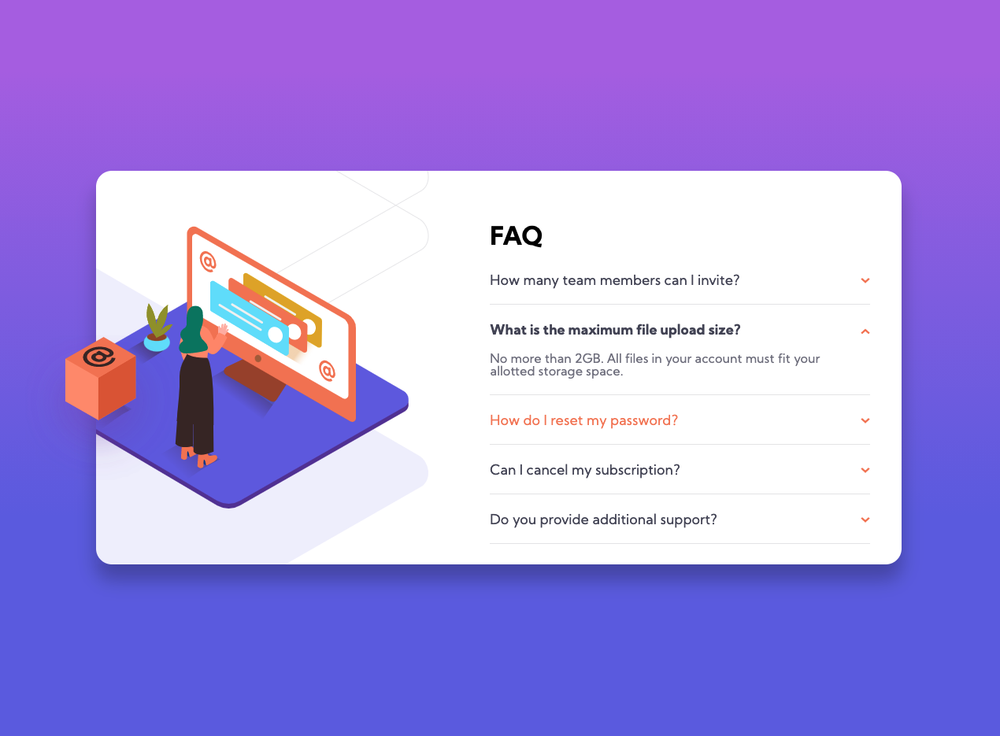

# Frontend Mentor - FAQ accordion card solution

This is a solution to the [FAQ accordion card challenge on Frontend Mentor](https://www.frontendmentor.io/challenges/faq-accordion-card-XlyjD0Oam). Frontend Mentor challenges help you improve your coding skills by building realistic projects. 

## Table of contents

- [Overview](#overview)
  - [The challenge](#the-challenge)
  - [Screenshot](#screenshot)
  - [Links](#links)
- [My process](#my-process)
  - [Built with](#built-with)
  - [What I learned](#what-i-learned)
- [Author](#author)
## Overview
### The challenge

Users should be able to:

- View the optimal layout depending on their device's screen size
- Click on the questions to show the answers and click again to hide them

### Screenshot

### Links

- Live Site URL: [Link](https://zen-agnesi-c3c4f6.netlify.app)

### Built with

- Semantic HTML5 markup
- CSS custom properties
- Flexbox
- Transitions
- Javascript (accordion)